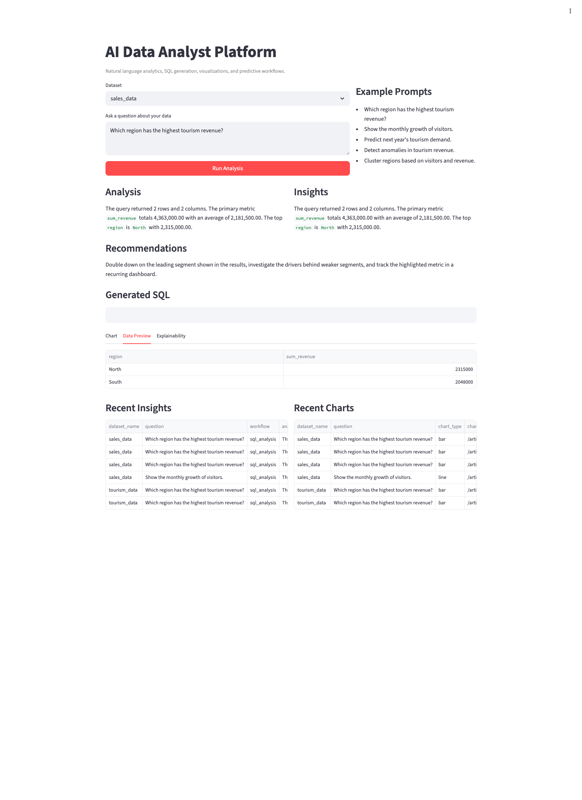
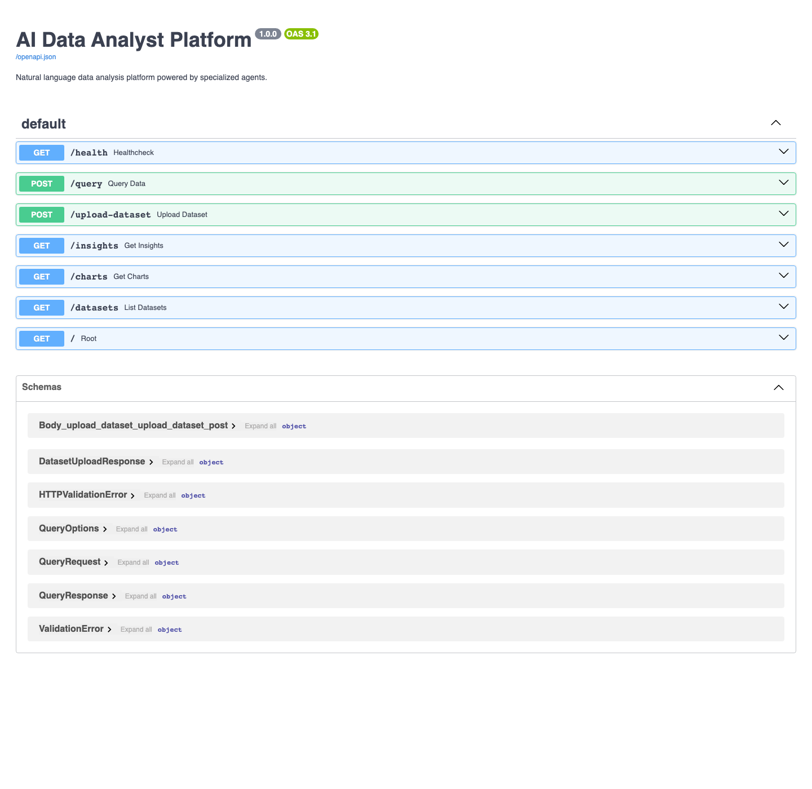
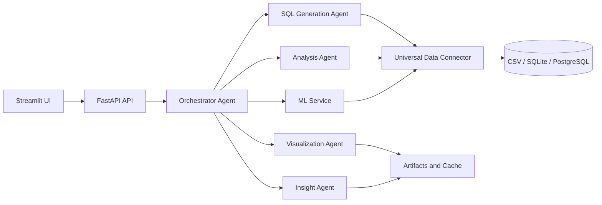

# AI Data Analyst Platform

Production-oriented natural language analytics platform built with FastAPI, Streamlit, pandas, SQLAlchemy, Plotly, and scikit-learn.

GitHub repository: `https://github.com/kutusho/ai_data_analyst`

## Deployment Target

The application is designed to run on a VPS behind a reverse proxy, with the backend and frontend exposed as separate services.

## Screenshots

### Streamlit analytics workflow



### FastAPI Swagger documentation



## What The Platform Does

- Translates natural language questions into safe read-only SQL
- Connects to CSV, SQLite, and PostgreSQL datasets
- Runs automated EDA and descriptive analytics
- Generates Plotly visualizations and downloadable artifacts
- Produces insight summaries and recommendations
- Supports forecasting, clustering, and anomaly detection
- Exposes the platform through FastAPI and Streamlit

Example questions:

- `Which region has the highest tourism revenue?`
- `Show the monthly growth of visitors.`
- `Predict next year's tourism demand.`
- `Detect anomalies in tourism revenue.`

## Architecture



Detailed docs:

- [Architecture](docs/ARCHITECTURE.md)
- [VPS Deployment](docs/VPS_DEPLOYMENT.md)

## Project Structure

```text
backend/         FastAPI app bootstrap and runtime configuration
api/             Request models, controllers, and HTTP routes
agents/          Orchestrator and specialized agents
database/        Connectors, dataset registry, and safe query execution
analytics/       EDA, statistics, trend, seasonal, and forecasting helpers
visualization/   Plotly chart generation
ml/              Forecasting, clustering, and anomaly detection services
frontend/        Streamlit application
datasets/        Bundled sample datasets
artifacts/       Generated charts and PDF reports
cache/           Registry, history, uploads, and query cache
docs/            Architecture, deployment, and screenshots
utils/           Logging and prompt helpers
```

## Core Workflows

### Natural language analysis

1. User submits a question and dataset name.
2. The orchestrator classifies the request.
3. The SQL agent generates a safe `SELECT` query.
4. The executor runs the query with caching enabled.
5. Analysis, visualization, and insight agents enrich the result.
6. The API returns structured JSON with analysis, insights, chart URL, and recommendations.

### Predictive workflows

- Forecasting: time series projection over an inferred metric
- Clustering: unsupervised segmentation over numeric columns
- Anomaly detection: outlier scoring over numeric features

## API Endpoints

- `GET /health`
- `GET /datasets`
- `POST /query`
- `POST /upload-dataset`
- `GET /insights`
- `GET /charts`
- `GET /artifacts/...`

## Example Request

```json
{
  "dataset_name": "tourism_data",
  "question": "Which region has the highest tourism revenue?",
  "options": {
    "forecast_periods": 12
  }
}
```

## Example Response

```json
{
  "analysis": "The query returned 2 rows and 2 columns. The primary metric sum_revenue totals 4,630,000.0 with an average of 2,315,000.0.",
  "insights": "North is the top-performing region by revenue. Revenue concentration is high enough to justify targeted investment and monitoring.",
  "chart_url": "/artifacts/charts/tourism_data_chart.html",
  "recommendations": "Double down on the leading region while monitoring weaker regions for recovery opportunities."
}
```

## Local Setup

### 1. Create a virtual environment

```bash
python3.11 -m venv .venv
source .venv/bin/activate
```

### 2. Install dependencies

```bash
pip install --upgrade pip
pip install -r requirements.txt
```

### 3. Configure environment variables

```bash
cp .env.example .env
```

Optional variables:

- `API_AUTH_TOKEN`
- `OPENAI_API_KEY`
- `OPENAI_MODEL`
- `DATABASE_URL`
- `API_BASE_URL`

### 4. Run the backend

```bash
uvicorn backend.main:app --reload
```

### 5. Run the frontend

```bash
streamlit run frontend/streamlit_app.py
```

## Bundled Sample Data

Included sample datasets:

- `datasets/tourism_data.csv`
- `datasets/sales_data.csv`

The tourism dataset contains:

- `year`
- `month`
- `region`
- `visitors`
- `revenue`

Sample datasets are auto-registered on startup.

## Deployment Notes

- The platform can be deployed on a VPS with `systemd`, Docker, or another process manager.
- A reverse proxy such as Nginx or Traefik should terminate HTTPS and route requests to the backend and frontend services.
- The backend and frontend should be exposed as separate services.
- Set `API_AUTH_TOKEN` to require a shared token for API access and artifact downloads.
- OpenAI integration is optional; without `OPENAI_API_KEY`, the platform uses deterministic fallback logic.

Operational details are documented in [docs/VPS_DEPLOYMENT.md](docs/VPS_DEPLOYMENT.md).
